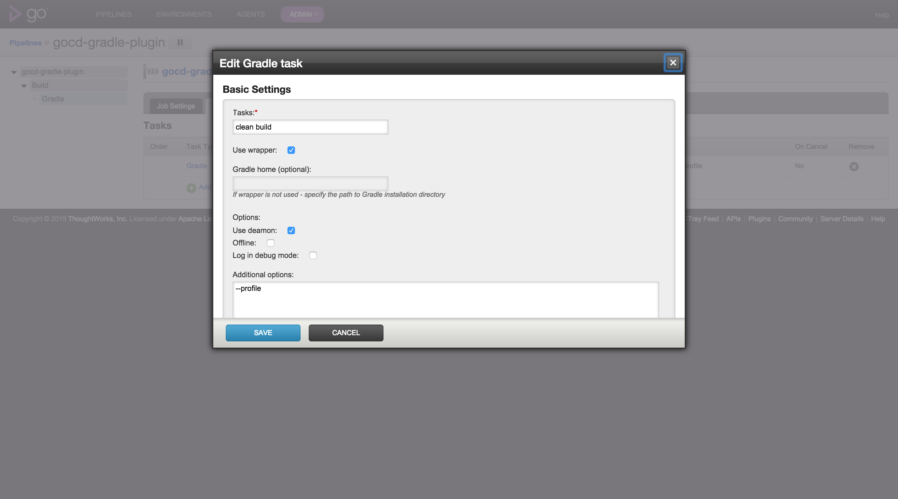

# Go Continuous Delivery Gradle plugin

> Go Continuous Delivery Gradle task plugin

## Installation

Download the plugin and copy it into `/$GO_SERVER_HOME/plugins/external` and restart the Go server.

The plugin should appear on Plugins page.

## Usage

Add Gradle tasks to your build stage.

## Options

### Tasks

The lists of Gradle tasks to execute. (required)
Example: clean build

### Use wrapper

Whether to run the wrapper script instead of gradle command

### Gradle home

The Gradle installation directory, needed only if wrapper isn't used and gradle is not on path.
You may also specify GRADLE_HOME environment variable either for the specific build or entire Go Environment.

### Use deamon

Whether to run Gradle deamon for build.

### Offline

Whether to run build in offline mode.

### Debug

Enables debug logging level.

### Additional options

Any additional options to pass to Gradle
Example: --parallel

## License

Apache 2.0